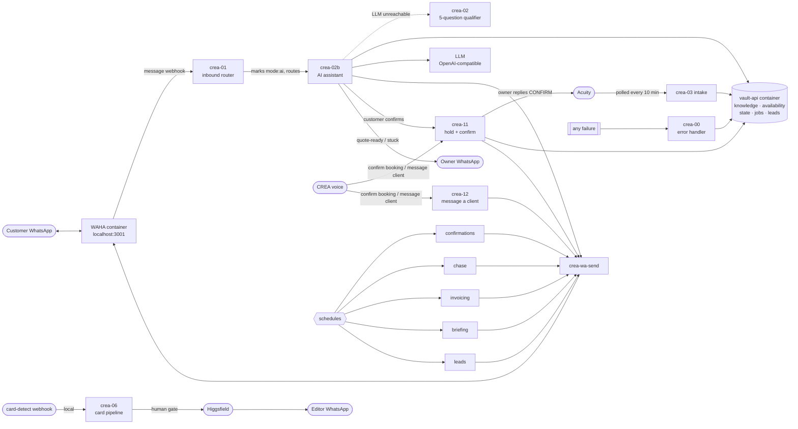

# CREA v3.1 — n8n Hands Layer

A **WhatsApp AI booking assistant** plus the shoot-ops automations (Acuity intake, shoot
confirmations, chase, card pipeline, invoicing, morning briefing, listing leads).

Self-healing and injection-hardened. Verified end-to-end against a live model on n8n 2.30.7, including the failure and attack cases — see `TEST-REPORT.md` and `COUNTERMEASURES.md`.

**v3.1 adds** progressive property intake, optional price estimates (`defer` / `packages` /
`calculator`), a details read-back the customer must say yes to, and an optional
hold → one-tap `CONFIRM` → real Acuity appointment flow. Job/lead/client notes are also
written in the CREA voice assistant's own format, so "hey CREA, when's my next booking"
works off the same memory. Every switch defaults to v3 behaviour — see **`BOOKING.md`**.

---

## Install

**Full runbook: `INSTALL.md`** — about an hour, mostly account signups and downloads.

Short version, once Docker Desktop is installed and running:

```bash
cp config.example.env config.env      # fill: CREA_OWNER_WA, CREA_WAHA_API_KEY, CREA_OMNIROUTE_KEY
./go-live.sh                           # brings the whole stack up and wires everything
./go-live.sh --qr                      # scan once with the bot phone
./go-live.sh --test                    # prove it's live
```

Then put your prices in `knowledge/crea-knowledge.md`, and read **`BOOKING.md`** for the
two booking decisions (does CREA quote a price; what happens when a customer confirms).
Everything after that — changing prices/wording, config, updates, new features, backups,
recovery — is in **`OPERATIONS.md`**.

**Handing it to someone:** give them `HANDOVER.md` + `INSTALL.md`.

---

## How it fits together



Three containers on one Mac (`deploy/docker-compose.yml`): **n8n**, **WAHA**, **vault-api**.
Private Docker network — **no public URL, no tunnel**. WhatsApp comes in through WAHA; Acuity
is polled outbound; the LLM is outbound HTTPS. `vault-api/server.js` has no dependencies and
stores everything as plain files under `CREA_VAULT_DIR`.

---

## What's here

| Path | |
|---|---|
| `INSTALL.md` | the runbook — start here |
| `deploy/docker-compose.yml` · `go-live.sh` · `fill-config.sh` | the whole stack + one-command deploy |
| `workflows/` | 16 workflows (table in `SETUP.md`) |
| `BOOKING.md` | the two booking decisions + `knowledge/pricing.json` |
| `vault-api/server.js` | memory + job store + knowledge + availability + conversation state — one zero-dep service |
| `knowledge/crea-knowledge.md` | what the assistant answers from. Ships usable; put prices in one table. `EXAMPLE-filled.md` shows a done one. |
| `config.example.env` | every account/key, each marked REQUIRED/optional |
| `HANDOVER.md` · `INSTALL.md` · `OPERATIONS.md` | cover note · one-time setup · day-2: changes, updates, features, backup, recovery |
| `COUNTERMEASURES.md` | every failure mode + attack → detection → automatic response → manual fallback |
| `SETUP.md` · `DATA-AND-BACKUP.md` · `TEST-REPORT.md` | how it fits together · full storage/sync guide · verification |
| `facet-template/` | the same shape generalised for any other assistant — `NEW-FACET.md` |
| `test/` | `mock-services.js` + `demo.sh` — reproduce the verification run offline |

---

## Design rules

- Every workflow is a MACRO with named steps (`meta.steps`); sub-workflows keep it decomposed.
- Three-layer error handling: node `retryOnFail` + `onError` · `crea-00` as every workflow's `errorWorkflow` · a layer-3 alert.
- **Placeholders only** — no secrets in the JSON. `fill-config.sh` substitutes `config.env` (inline comments stripped).
- Conversation state + transcript live in the vault API, **never model memory**.
- The assistant answers **only** from `knowledge/crea-knowledge.md` and never invents a price, a time, or a policy.
- Money and outbound publishes are human-gated (invoices draft only; card pipeline waits for the owner's OK).
- No public ingress: WhatsApp is same-machine via WAHA, Acuity is polled, everything else is outbound.
- **Self-healing:** LLM circuit breaker + fallback endpoint, Docker healthchecks, a host watchdog.
- **Hardened:** injection-resistant prompt + a deterministic reply guard, rate limiting, a blocklist.
- **Observable:** health endpoint + dashboard, daily self-check, incident log, briefing health line.

## Why this beats a keyword bot

The instance this was modelled from was a keyword-match chatbot with a Gemini API key
hardcoded in a node URL, backends on raw IP addresses, and no error handling. This one:
answers real questions from an editable knowledge file, quotes only verified prices, degrades
to a deterministic flow when the model is down, keeps every value in one config file, records
every failure, holds conversation state so fast follow-up messages don't get misrouted, and
ships with a reproducible test.
