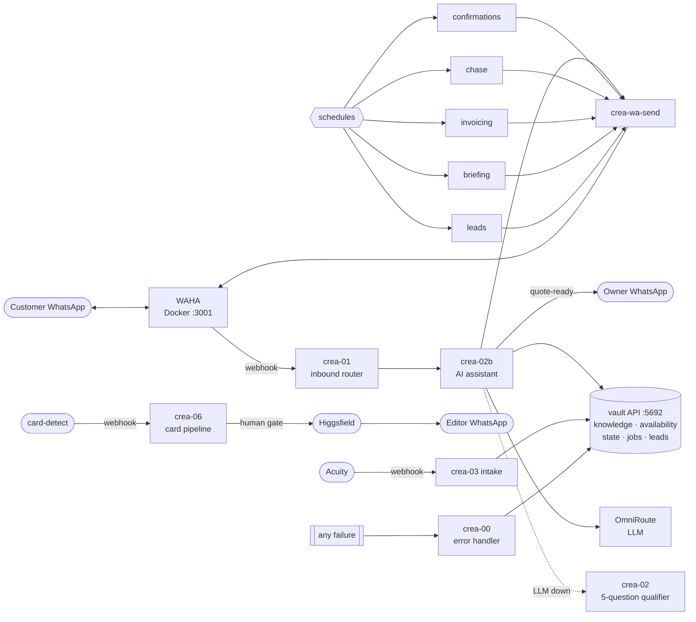

# CREA — n8n Hands Layer

A **WhatsApp AI booking assistant** plus the shoot-ops automations (Acuity intake, shoot
confirmations, chase, card pipeline, invoicing, morning briefing, listing leads). Optional —
CREA's voice + vault work without it.

Verified end-to-end against a live model on n8n 2.30.7 — `TEST-REPORT.md`, `test/run-report.html`.

---

## Setup

**Handing it to someone:** give them **`HANDOVER.md`** — a 10-minute gather list, then one
prompt they paste into Claude Code that does the whole install.

**Yourself:**

```bash
cd n8n
cp config.example.env config.env      # fill: CREA_OWNER_WA, CREA_WAHA_API_KEY, CREA_OMNIROUTE_URL/KEY
./go-live.sh
```

Then scan the WhatsApp QR at `localhost:3001` and paste the Acuity webhook. Everything else
is `go-live.sh`. Full detail in `SETUP.md`.

---

## How it fits together



The vault API and OmniRoute are the only running services besides n8n and WAHA. The vault API
(`vault-api/server.js`, no dependencies) stores everything as plain files under
`vault-api/data/`.

---

## What's here

| Path | |
|---|---|
| `workflows/` | 12 workflows (table in `SETUP.md`) |
| `vault-api/server.js` | memory + job store + knowledge + availability + conversation state — one zero-dep service |
| `knowledge/crea-knowledge.md` | what the assistant answers from. Ships usable; put prices in one table. `EXAMPLE-filled.md` shows a done one. |
| `waha/` | WhatsApp gateway (Docker) — unofficial personal-number pairing per the manual |
| `facet-template/` | the same shape generalised for any other assistant — `NEW-FACET.md` |
| `config.example.env` | every account/key, each marked required/optional |
| `go-live.sh` · `fill-config.sh` | deploy + config substitution |
| `HANDOVER.md` · `SETUP.md` · `TEST-REPORT.md` | client handover, full setup, test evidence |
| `test/` | `mock-services.js` + `demo.sh` — reproduce the verification run offline |

---

## Design rules

- Every workflow is a MACRO with named atomic steps (`meta.trisAtoms`); sub-workflows keep it decomposed.
- Three-layer error handling: node `retryOnFail` + `onError` · `crea-00` as every workflow's `errorWorkflow` · a layer-3 alert.
- **Placeholders only** — no secrets in the JSON. `fill-config.sh` substitutes `config.env`.
- Conversation state + transcript live in the vault API, **never model memory**.
- The assistant answers **only** from `knowledge/crea-knowledge.md` and never invents a price, a time, or a policy.
- Money and outbound publishes are human-gated (invoices draft only; card pipeline waits for the owner's OK).

## Why this beats a keyword bot

The instance this was modelled from was a keyword-match chatbot with a Gemini API key
hardcoded in a node URL, backends on raw IP addresses, and no error handling. This one:
answers real questions from an editable knowledge file, quotes only verified prices, degrades
to a deterministic flow when the model is down, keeps every value in one config file, records
every failure, and ships with a reproducible test.
